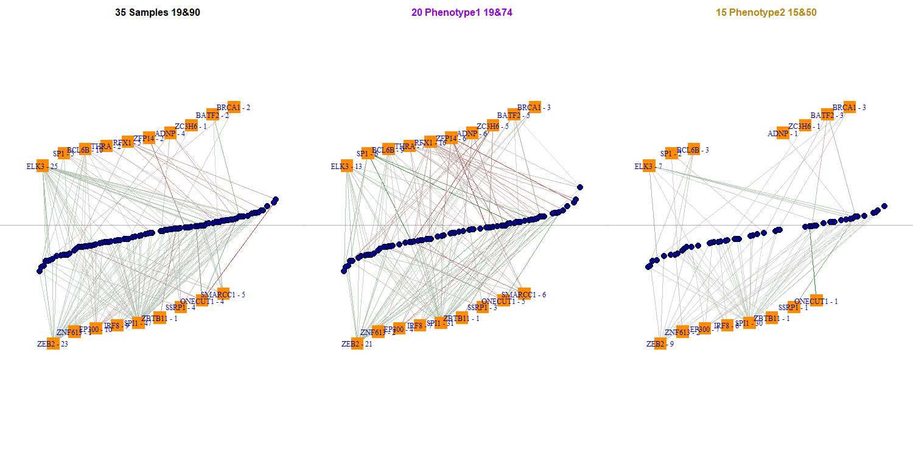
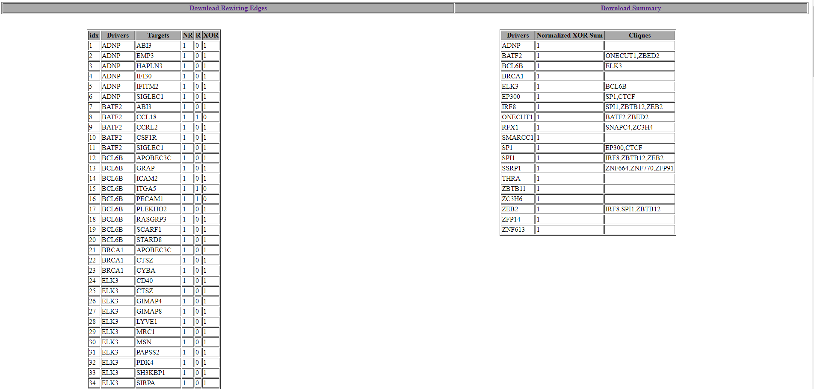

```{r LoadFunctions, echo=FALSE, message=FALSE, warning=FALSE, results='hide'}
library(knitr)
opts_chunk$set(error = FALSE, warning=FALSE, eval=FALSE)
library(TraRe)
```

```{r style, echo = FALSE, results = 'asis'}
## BiocStyle::markdown()
```

# Introduction

To fully understand how TraRe works, we will go through each tool it contains: 

* *Bayesian machine learning model for gene regulatory network inference*: a module-based approach to infer gene regulatory networks (GRN) from RNAseq data.
* *Phenotype-associated Rewiring test*: to identify disrupted modules subject to a phenotype condition.
* *Three-tier analysis of results*: to uncover robust disruptions at the transcription factor (TF) level, at the regulon level and at the transcriptional module level.
* *Visualization*, to graphically display the generated transcriptional rewired modules or GRNs.
* *Results report*, directory containting pdf, html and data files (txt and excel) with useful information about the TFs-target relationships inferred.

We consider important to use a real dataset for a proper understanding of TraRe's results, therefore, along with every step description and explanation, we will be working with a subset of the Stand Up To Cancer (SU2C) clinical trial dataset containing 1.2k genes ($\approx$ 200 TFs or *driver* genes) and 121 samples from metastatic castration resistant prostate cancer (mCRPC) patients that were never treated with androgen receptor signalling inhibitors (ARSI) Abiraterone or Enzalutamide. 
A subset of these patients present a clinical phenotype of response that we categorized in a *binary* variable (**Responder** or **Non-responder**). Thus, for the phenotype dependent *rewiring test*, we will be focusing on only on this subset of patients. 

Original expression and clinical data ($\approx$ 19300 genes) can be found in the database of Genotypes and Phenotypes (dbGaP) with accession code phs000915.v2.p2 and the cBioPortal (RRID:SCR_014555) Public Datahub. Gene description data was downloaded from *https://v22.proteinatlas.org/download/proteinatlas.tsv.zip*
Data used in this vignette is located at TraRe's package directory and the following GitHub repository (*https://github.com/ubioinformat/TraRe/tree/master/inst/extdata/VignetteFiles*)

The main workflow to follow is:
  
* Run TraRe's inference method with the `trare_preprocessing` and `LINKER_run` functions on the gene expression matrix ($genes \times samples$), to generate the modules governing the transcriptomic activity of all samples. A module represents one or several related biological functions. This step is performed repeatedly within a bootstraping process that takes in each run a designated proportion of the samples (80% by default).

* Run TraRe's rewiring test with the `preparereriwring` and `runrewiring` functions by selecting the sample's phenotype to extract the modules which expression can be separated very well according to the selected phenotype. Selected modules will be scored based on a hypergeometric test and similar modules will cluster together generating robust rewired transcriptional modules. This step automatically pulls out an html report for visualization and a directory with the results.

Additional analysis: 

* Run TF and regulon level analysis with the `rewiring_gene_level` and `rewiring_regulon_level` functions.
* Run *cliques* option to include all possible TFs with significant role in the phenotype gene expression.
* Run visualization functions manually to customized the output.


TraRe mainly requires three types of files or a SummarizedExperiment (SE) object with the following data:

* **Gene expression matrix**: log2-normalized gene expression matrix that acounts for library size (examples FPKM, TPKM, etc.), *lognorm_est_counts* or the similar data stored in a `SummarizedExperiment::assay(SE)` object.

* **Gene description data**: an array with the gene IDs of the TFs or genes to be considered as *regulators* in the gene expression matrix. The rest of the genes will be considered as target genes. In a SE object this information should be in the `SummarizedExperiment::rowData()` as a boolean variable called *gene_info*.

* **Phenotype dataframe**: an dataframe with the Sample IDs in the `rownames()` and a column named *phenotype* that codifies a **binary phenotype**. This variable will be converted to a factor with two levels and labels `c(0,1)`,thus the order of the factor levels will be set automatically by alphabetical order. Note that if this information is incorporated in a SummarizedExperiment object from the beginning of the pipeline **and** not all samples have the phenotype information (NAs), NA's will be omitted at the rewiring test. 

# Before start
### Examples for gene expression normalization

We can use the `varianceStabilizingTransformation` function from `DESeq2` package and chose the option that shows the minimum heteroskedasticity as seen in these plots
```{r, eval = FALSE}

require(DESeq2)
require(vsn)
require(ggplot2)
require(egg)

gene_mat <- as.matrix(read.csv("Your_Expression_Dataset_file.csv"))

vst_data_norm_param<-varianceStabilizingTransformation(gene_mat, fitType = "parametric")
vst_data_norm_mean<-varianceStabilizingTransformation(gene_mat, fitType = "mean")
vst_data_norm_local<-varianceStabilizingTransformation(gene_mat, fitType = "local")


a<-vsn::meanSdPlot(vst_data_norm_param)$gg + ggtitle("Normalized VST with Parametric Dispersion Fitting")
b<-vsn::meanSdPlot(vst_data_norm_mean)$gg + ggtitle("Normalized VST with Mean Dispersion Fitting")
c<-vsn::meanSdPlot(vst_data_norm_local)$gg + ggtitle("Normalized VST with Local Dispersion Fitting")

egg::ggarrange(a,b,c,nrow=2,ncol=2)

```
# Quick start 
## Installation
TraRe can be currently installed from Bioconductor:

```{r, eval=FALSE}

 if (!requireNamespace("BiocManager"))
 install.packages("BiocManager")
 BiocManager::install("TraRe")
 
 ## Latest version in GitHub:
 # devtools::install_github('ubioinformat/TraRe',build_vignettes = TRUE)

```
## Full workflow with a SummarizedExperiment object

We will use a *SummarizedExperiment* object with the gene expression matrix in the SummarizedExperiment::assay() and the gene info stored in the SummarizedExperiment::rowData().
If you plan to do the differential network analysis (i.e. full workflow with rewiring test), then phenotype info should be stored in the SummarizedExperiment::colData().
```{r, eval = TRUE}
#  Expression matrix path
lognorm_est_counts_p <- paste0(system.file("extdata", package = "TraRe"),
               '/VignetteFiles/1_expression_quickexample_vignette.txt')

# Gene info dataframe path
gene_info_p <- paste0(system.file("extdata",package="TraRe"),
               '/VignetteFiles/1_geneinfo_example_vignette.txt')

# # Sample phenotype dataframe path
phenotype_p <- paste0(system.file("extdata",package="TraRe"),
               '/VignetteFiles/1_phenotype_rewiring_quickexample_vignette.txt')

# REWIRING output path
outdir <- system.file('extdata', package='TraRe')

# We load gene expression matrix and convert it to matrix class
lognorm_est_counts <- as.matrix(utils::read.delim(lognorm_est_counts_p))


# We load gene info dataframe
geneinfo <- utils::read.delim(gene_info_p, row.names = 1)
# We have to make sure both dataframes have same rows (same genes).
geneinfo <- geneinfo[rownames(lognorm_est_counts),,drop=FALSE]
# The variable in the gene_info object must be "gene_info"
colnames(geneinfo) <- "gene_info"

# We load phenotype
phenotype <- utils::read.delim(phenotype_p,row.names = 1, sep=",")
# We have to make sure phenotype rows and lognorm_est_counts columns
# are the same.
phenotype <- phenotype[colnames(lognorm_est_counts),,drop=FALSE]
# The variable name must be "phenotype"
colnames(phenotype) <- "phenotype"

# Now we can generate the SE object
SeObject <- SummarizedExperiment::SummarizedExperiment(
                                    assays = list(counts = lognorm_est_counts),
                                    rowData = geneinfo,
                                    colData = phenotype)

# saveRDS(object = SeObject,
#         file = paste0(system.file("extdata",package = "TraRe"),
#              '/VignetteFiles/1_SeObject_quickexample_vignette.rds'))

# We preprocess the original matrix for low variance in genes and samples
TraReObj <- TraRe::trare_preprocessing(data_matrix = SeObject, verbose =TRUE)
# saveRDS(object = TraReObj, 
#         file = paste0(system.file("extdata",package = "TraRe"),
#               '/VignetteFiles/1_TraReObj_quickexample_vignette.rds'))

```
```{r,eval=TRUE,warning=FALSE,echo=FALSE}
TraReObj <- readRDS(file = paste0(system.file('extdata', package = 'TraRe'),
              '/VignetteFiles/1_TraReObj_quickexample_vignette.rds'))
```
Now we run the inference method. This step may take some time depending on the size of the data. For the vignette purposes we set the parameter `Nr_bootstraps` to 5 but we recommend use at least 10 bootstraps (as the default setting).
```{r, warning = FALSE, eval= TRUE}
# For time purposes the vignette will be executed for just 2 bootstrap but the
# file found in package extdata corresponds to a 10 bootstrap run.

set.seed(123)
# We run the GRN inference method 
linkeroutput <- TraRe::LINKER_run(TraReObj,
                                  link_mode = "VBSR",
                                  module_rep = "LINKER",
                                  graph_mode = "VBSR",
                                  NrModules = 50,
                                  Nr_bootstraps = 1, # 10
                                  corrClustNrIter = 100) 

# We saved the 10-bootstrap output and import it later by using the following code:

# saveRDS(object = linkeroutput,
#         file = paste0(system.file('extdata', package = 'TraRe'),
#         '/VignetteFiles/1_linkeroutput_quickexample_vignette.rds'))
```
```{r,eval=TRUE,warning=FALSE,echo=FALSE}
linkeroutput <- readRDS(file = paste0(system.file('extdata', package = 'TraRe'),
                    '/VignetteFiles/1_linkeroutput_quickexample_vignette.rds'))
```
Now we run the Rewiring test
```{r, eval=TRUE}
# Prepare data for rewiring
prew_output <- TraRe::preparerewiring(name="Vignette_quickexample", 
                                      TraReObj = TraReObj,
                                      linker_output= linkeroutput,
                                      final_signif_thresh = 0.05, 
                                      nrcores = 1,
                                      outdir=paste0(outdir,"/VignetteFiles/"))
```
```{r, eval = FALSE, warning = FALSE}
# Run rewiring
TraRe::runrewiring(prew_output)                             
```
In the `output` directory we will find the results from the rewiring with the plots, statistics and html report.


# Generating the GRN modules
## Overview of the GRN inference method
The aim of the proposed method is to find relatively small networks
that link few regulatory or "driver" genes, usually TFs, with a similarly regulated
set of genes, also known as the target genes. 
In order to build such networks, the method is proceeds in two
phases. During *Phase I* it generates $K$ modules of similarly
expressed genes and then associates each module to a few regulators using *Variational Bayes Spike Regression (VBSR)*\*.

Due to the non-convex nature of the problem, we perform
$B$ runs (*bootstraps*) of this step using a different set of samples (by default 80% sub-sampling
without replacement) with a different random initialization in order
to explore more broadly the set of potentially valid modules. Thus, at 
the end of this step the method has generated
$K \times B$ modules of similarly regulated genes, each of them with their
associated regulators.  During *Phase II* the proposed method generates, for each module, 
a bipartite graph that links the individual target genes to their associated regulators. 
Using again the a VBSR model, if no combination of regulators represents accurately the expression profile of a given target gene, that gene is
removed from the graph. This scenario arises when this target gene is an outlier in the module.

\*Note: two other regression methods are also available in the package (See Section "XXX")

## How to run `trare_preprocessing` and `LINKER_run` in TraRe

`trare_preprocessing` is a helper function to preprocess the data (filter genes and samples with low variance) prior to the GRN inference process.
A **SummarizedExperiment** object can be used or otherwise:

- **data_matrix**: a matrix of log-normalized estimated counts of the gene expression data ($Nr Genes \times Nr samples$).
- **geneinfo**: character array with gene IDs to be considered as regulators (e.g. TFs).
- **low_var_genes_th**:  threshold to drop out low variance genes across samples. Default: 0.25
- **low_var_samples_th**: threshold to drop out low variance samples across genes. Default: 1

The returned object is a **TraReObj** containing preprocessed input matrix and associated info to pass to the function `LINKER_run`
```{r, eval = TRUE}
# We load gene expression matrix and convert it to matrix class
lognorm_est_counts_p <- paste0(system.file('extdata',package='TraRe'),
                              '/VignetteFiles/2_expression_rewiring_example.txt')

lognorm_est_counts <- as.matrix(utils::read.delim(lognorm_est_counts_p))

# Gene info dataframe path
gene_info_p <- paste0(system.file("extdata",package="TraRe"),
               '/VignetteFiles/1_geneinfo_example_vignette.txt')

# We load gene info dataframe
geneinfo <- utils::read.delim(gene_info_p, row.names = 1)

# We have to make sure geneinfo and lognorm_est_counts have
# same rows (same genes).
geneinfo <- geneinfo[rownames(lognorm_est_counts),,drop=FALSE]

# We keep the TFs names in the vector
geneinfo = rownames(geneinfo)[which(geneinfo$regulator==1)]

TraReObj2 <- TraRe::trare_preprocessing(data_matrix = lognorm_est_counts,
                                       geneinfo = geneinfo,
                                       verbose = TRUE)

# saveRDS(object = TraReObj2, 
#         file = paste0(system.file('extdata',package='TraRe'),
#               '/VignetteFiles/2_TraReObj_rewiring_example.rds'))
```
```{r,eval=TRUE,warning=FALSE,echo=FALSE}
TraReObj2 <- readRDS(file = paste0(system.file('extdata', package = 'TraRe'),
              '/VignetteFiles/2_TraReObj_rewiring_example.rds'))
```

`LINKER_run` generates, from an processed RNA-Seq dataset where TFs and target genes are provided, GRN modules in three different forms: as raw results, from the *Phase I* output; as modules from the *Phase II* output and in the form of bipartite graphs, where drivers and targets relationships are defined. Here we include all the parameters and their description. For more information, please refer to the help section of `LINKER_run()`.

- **TraReObj**: containing preprocessed input matrix (linker_preprocessing output).
- **link_mode**: Chosen method(s) to link module eigengenes to regulators. The available options are
   "VBSR", "LASSOmin", "LASSO1se" and "LM". By default, all methods are chosen.
- **graph_mode**: Chosen method(s) to generate the edges in the bipartite graph. The available options
   are "VBSR", "LASSOmin", "LASSO1se" and "LM". By default, all methods are chosen.
- **module_rep**: Method selected for use. Default set to MEAN.????
- **NrModules**: Number of modules that are a *priori* to be found (note that the final number of modules
   discovered may differ from this value). By default, 100 modules.
- **corrClustNrIter**: output from preparedata(). By default, 100.
- **Nr_bootstraps**: Number of bootstrap of Phase I. By default, 10.
- **FDR**: The False Discovery Rate correction used for the enrichment analysis. By default, 0.05.
- **Lambda**: variable for Lasso models.
- **train_size**: Fraction of samples selected for the train samples. Default: 0.8.
- **onlymods**: Whether to infer only modules or modules and graphs. Default: FALSE
- **only_train**: whether to use only training samples within LINKER run. Default: FALSE

We now run `LINKER_run` method below to generate all possible GRNs. 

\*\*Note that this function has no information regarding the phenotype of the samples,
even if a *SummarizedExperiment* object is provided to the `trare_preprocessing` function, `LINKER_run` will not make use of the phenotype data.
This information can be added later on to the object for the differential network analysis step (*Rewiring*) if a *SummarizedExperiment* was not used.


```{r, warning = FALSE, eval =TRUE}
# We recommend VBSR as the model as it outperforms the other methods
# For this vignette example and to save computing time 
# the matrix we are using a subset of the original and we will be running 
# only 1 bootstrap, but the results below will show a 10 bootstraps LINKER_run.

linkeroutput2 <- TraRe::LINKER_run(TraReObj = TraReObj2,
                                   link_mode='VBSR',
                                   graph_mode ='VBSR',
                                   module_rep= 'LINKER',
                                   NrModules = 50,
                                   Nr_bootstraps = 1, #10
                                   corrClustNrIter = 100,
                                   train_size = 0.8)
# We save it for later
# saveRDS(object = linkeroutput2, 
#         file = paste0(system.file('extdata', package='TraRe'),
#         '/VignetteFiles/2_linkeroutput_rewiring_example.rds'))

```
# Rewiring of the GRN modules

## Overview of Rewiring method

* *Rewiring* step performs a permutation test over a certain condition to infer if that condition is producing any deregulation on our GRNs. Thus, for each GRN generated in the previous step the difference of the gene-gene covariance matrix 
associated with each binary-labeled phenotype is computed separately, namely $\Sigma^0$ and $\Sigma^1$. Then, the 
distance between the two covariance matrices is computed as the Frobenius norm of the difference between both of them.
$$s = \sum_{i}\sum_{j} (\Sigma^0_{ij} - \Sigma^1_{ij})^{2}$$
This distance $s$, which we term the rewiring score, is used as a statistic to measure the dissimilarity 
between the  covariance  matrices, and thus, the **differential transcriptional rewirings** of the modules across phenotypes. 
A module is said to be rewired if its rewiring score $s$ satisfies $P_{H_0}(s) < \tau$ where $\tau$ is a user-defined 
threshold (**final_signif_thresh** parameter). A significant dissimilarity over the covariance matrices may indicate fundamental underlying disruptions in gene co-expression between phenotypes.

Bootstrapping plays an important role, as the non-convex nature of these biological events makes necessary
to ensure that a certain behavior is repeated across bootstraps, and to confirm this event does not come from a particular realization.
As bootstrapping has been performed in `LINKER_run`, the rewiring step will take advantage of it and will try to group, with hierarchical clustering, highly scored modules with similar behavior across bootstraps, named as *trancriptional modules*. 

Therefore after this step the package will output a folder containing :

* A correlation matrix of the rewired modules in the form of a heatmap (sorted by hierarchical clustering to ease interpretation), containing similar highly scored modules.
* A dendogram containing the relationships between these modules, which have been used to sort the heatmap.
* A 3-graph plot, containing the identified transcriptioal module within all samples and separated by sample's phenotype, to visualized the network disruption.
* A report containing statistical information about the transcriptional module: driver genes, target genes, pvalues, etc.


## How to run the rewiring on TraRe

In order to do the differential network analysis, TraRe provides two functions: `preparerewiring()`  and `runrewiring()`. 
The first one gathers all the data in an object list to be used by the second. 
The information needed by `preparerewiring()` is:

- **name**: Desired name of the folder which is generated. The chosen threshold will be `paste()` to the name folder.
- **TraReObj**: the *TrareObj* generated during preprocessing step before GRN inference with the phenotype data included.
- **linker_output**: Output from `LINKER_run` function.
- **final_signif_thresh**: Significance threshold for the rewiring method ($\tau$). The lower the threshold, the more  restrictive the method.
- **outdir**: Directory for the output folder to be located (default: tempdir())
- **nrcores**: Number of cores to run the parallelization within the rewiring test (default: 3).

There are also other parameters that will remain by default. Please take a look at the `preparerewiring()` function for more information. We now generate 
the `preparerewiring()` output.
```{r, eval= TRUE,include = FALSE, warning=FALSE,echo = FALSE}
rewiring_add_phenotype <- function(TraReObj, phenotype_f){
  TraReObj_out <- TraRe::TraReClass(lognorm_counts = TraReObj@lognorm_counts[,rownames(phenotype_f)],
                         target_idx = TraReObj@target_idx,
                         regulator_idx = TraReObj@regulator_idx,
                         pheno = as.numeric(factor(phenotype_f[,'phenotype'],
                                                   labels = c(0,1))) - 1)
  # TraReObj@lognorm_counts <- TraReObj@lognorm_counts[,rownames(phenotype_f)]
  # TraReObj@pheno <- as.numeric(factor(phenotype_f[,'phenotype'],labels = c(0,1))) - 1
  
  return(TraReObj_out)
}
```
```{r, eval= TRUE, warning=FALSE }

## Load the linker output
linkeroutput2 <- readRDS(paste0(system.file('extdata',package='TraRe'),
                          '/VignetteFiles/2_linkeroutput_rewiring_example.rds'))
# ## Load the phenotype file
phenotype_p <- paste0(system.file('extdata',package='TraRe'),
                      '/VignetteFiles/2_phenotype_rewiring_example.txt')

phenotype <- read.delim(phenotype_p, row.names = 1)
colnames(phenotype) <- 'phenotype'

## Add the phenotype if it was not in the previous TraReObj
## using the helper function `rewiring_add_phenotype`
TraReObj3 <- rewiring_add_phenotype(TraReObj2, phenotype)

# saveRDS(object = TraReObj3, file = paste0(system.file('extdata',package='TraRe'),
#                           '/VignetteFiles/3_TraReObj_rewiring_example_pheno.rds'))

outdir <- system.file('extdata', package='TraRe')
prew_output <- TraRe::preparerewiring(name = 'Vignette_Rewiring',
                                      linker_output =linkeroutput2,
                                      TraReObj = TraReObj3,
                                      final_signif_thresh = 0.05,
                                      nrcores = 1,
                                      outdir = paste0(outdir,"/VignetteFiles/"))

# saveRDS(object = prew_output, file = paste0(outdir,
                           #   '/VignetteFiles/2_preprew_rewiring_example.rds'))

# TraRe::runrewiring(prew_output) 
```
```{r include = FALSE, eval = TRUE, echo = FALSE, warning = FALSE,  message = FALSE}
# Create the png versions for vignette output

pdftools::pdf_convert(
     pdf = paste0(outdir,"/VignetteFiles/Vignette_Rewiring_0.05/supermod_rewiring/imgs/mod_sim.VBSR.1.dendro.pdf"),
     format = "png",
     pages = NULL,
     filenames = paste0(outdir,"/VignetteFiles/mod_sim.VBSR.1.dendro.png"),
     dpi = 72,
     antialias = FALSE,
     opw = "",
     upw = "",
     verbose = FALSE
 )

pdftools::pdf_convert(
     pdf = paste0(outdir,"/VignetteFiles/Vignette_Rewiring_0.05/supermod_rewiring/imgs/mod_sim.VBSR.1.heatm.pdf"),
     format = "png",
     pages = NULL,
     filenames = paste0(outdir,"/VignetteFiles/mod_sim.VBSR.1.heatm.png"),
     dpi = 72,
     antialias = FALSE,
     opw = "",
     upw = "",
     verbose = FALSE
 )


pdftools::pdf_convert(
     pdf = paste0(outdir,"/VignetteFiles/Vignette_Rewiring_0.05/supermod_rewiring/supermodule1.VBSR.4/imgs/igraphs.raw.full_graph.pdf"),
     format = "png",
     pages = NULL,
     filenames = paste0(outdir,"/VignetteFiles/igraphs.raw.full_graph.png"),
     dpi = 72,
     antialias = FALSE,
     opw = "",
     upw = "",
     verbose = FALSE
 )


pdftools::pdf_convert(
     pdf = paste0(outdir,"/VignetteFiles/Vignette_Rewiring_0.05/supermod_rewiring/supermodule1.VBSR.4/imgs/igraphs.refined.graphs.pdf"),
     format = "png",
     pages = NULL,
     filenames = paste0(outdir,"/VignetteFiles/igraphs.refined.graphs.png"),
     dpi = 72,
     antialias = FALSE,
     opw = "",
     upw = "",
     verbose = FALSE
 )
```
In order to run `runrewiring(prew_output)`, we just call the function with the output of `preparerewiring()`. 
It will create a directory on the specified output path with an html report and statistical information about the performed test as described above.

```{r eval = TRUE,ref-cluster, include=TRUE, echo = FALSE, message=FALSE, fig.align='center', fig.cap='Rewiring Dendogram'}
knitr::include_graphics(path=paste0(outdir,"/VignetteFiles/mod_sim.VBSR.1.dendro.png"))

```

```{r eval = TRUE,ref-heatm,include=TRUE, echo = FALSE, message=FALSE, fig.align='center', fig.cap='Rewiring Heatmap'}
knitr::include_graphics(path=paste0(outdir,"/VignetteFiles/mod_sim.VBSR.1.heatm.png"))

```

In Figure \@ref(fig:ref-cluster) above is the Hierarchical Clustering representation of the transcriptional modules. The current implementation of the *Rewiring*
method by default calculates all transcriptional modules that the hierarchical clustering finds except for the last one (the one with higher number of edges which should have little in common between each other) and generates all the graph objects and figures seen below and in the next sections. Note that the "order" of the clusters are not necessarily set from left to right, we recommend to visually check the heatmap and dendogram output to validate the transcriptional modules. Should you required to compute different/specific GRNs see section below (Visualization of the GRNs).

As shown in Figures \@ref(fig:ref-cluster) and \@ref(fig:ref-heatm), there are 5 clusters with one more clear rewired and robust **Transcriptional Module** (second to right). For a transcriptional module to be identified firstly, the modules contained in it should present genes whose expression can be separated very well using the desired phenotype (*rewired* modules), and secondly, they have to show similar behavior across bootstraps, with a high score given by an hypergeometrical test. Therefore, in this example there are three transcriptional modules formed by the following modules: `c(102,153)`, `c(148,20,37,96)`, `c(100,109,11,158,191,206,25,41,95)`, and `c(104,121,138,159,166,188,203,21,,30,55,81,9)`.


```{r eval = TRUE, ref-rawgraph,include = TRUE, echo = FALSE,  message=FALSE, fig.align='center', fig.cap='Raw Full Graph'}
knitr::include_graphics(path=paste0(outdir,"/VignetteFiles/igraphs.raw.full_graph.png"))

```

In Figure \@ref(fig:ref-rawgraph) is the raw graph for the transcriptional module mentioned above. Targets are sorted based on a Z-score derived from a t-test with null hypothesis if samples separated by the selected condition are not deferentially expressed.
The color of the edge between the target and the TF is defined by weight of the regression coefficient. 

\*Note that for the GRN inference method genes with low variance across samples were excluded. When using additional samples in the GRN inference method than the ones present in the phenotype matrix it can happen that some additional genes need to be excluded due to lack of variance across this new set of samples to avoid computing errors in the rewiring test. This exclusion is already incorporated in the `preparerewiring()` function.

# Rewiring at the gene level

To investigate which TF are driving significant differences in the transcriptional modules between the phenotype condition TraRe provides the 
function `rewiring_gene_level`. We propose to use it using the liker_output generated with **50 bootstraps** to increase the power of the test. The function first performs
the *Rewiring test* on all the modules found by `LINKER_run` and then, for each TF, it performs a Fisher's test to discriminate whether this TF is more likely be found in rewired modules or not.

Below are the main parameters of the function:

- **fpath** Desired path for the rewiring file to be generated (or path to existing file).
- **linker_output**: Output from `LINKER_run` function (recommended with 50 bootstraps).
- **TraReObj**: the *TrareObj* generated during preprocessing step before GRN inference with the phenotype information.
- **final_signif_thresh** Significance threshold for the rewiring method ($\tau$). The lower the threshold, the more restrictive the method. Default set to 0.05.
- **ImpTH** Threshold for the refinement of the returned list. Default set to 0.05.
- **nrcores** Number of cores to run the parallelization within the rewiring test (default: 3).

The output of this function are two .txt files: 
1. The list of the rewired modules of the linker_output object
2. The list of rewired TFs together with the p-value obtained in the Fisher's test and the Odds Ratio (OR).

```{r, eval = TRUE,  echo = TRUE}
  fpath <- paste0(system.file('extdata',package='TraRe'),
                                '/VignetteFiles/3_rewired_modules_50boots.txt')

  linkeroutput_50b <- readRDS(paste0(system.file('extdata',package='TraRe'),
                           '/VignetteFiles/3_linkeroutput_50boots_example.rds'))
  TraReObj3 <- readRDS(paste0(system.file('extdata',package='TraRe'),
                        '/VignetteFiles/3_TraReObj_rewiring_example_pheno.rds'))
# At the gene level (50 bootstraps)
  impgenes <-  TraRe::rewiring_gene_level(linker_output = linkeroutput_50b,
                                   TraReObj = TraReObj3,
                                   fpath = fpath,
                                   final_signif_thresh = 0.05,
                                   ImpTH = 0.05,
                                   include_cliques=TRUE,
                                   cliquesTH=0.8,
                                   nrcores = 1)
  print(impgenes)
# # Save
  # write.table(impgenes, file=paste0(outdir,'/VignetteFiles/3_table_rewired_tfs.tsv'),
  #             row.names = TRUE, sep = "\t")
```
# Rewiring at the regulon level

TraRe also provides a function to extract from rewired modules the curated *rewired regulon* for each TF. Again, we recomend to run it using a **50-bootstraps** linker output for robustness.

Below are the main parameters for the `rewiring_regulon_level` function:

- **linker_output**: Output from `LINKER_run` function (recommended with 50 bootstraps).
- **TraReObj**: the *TrareObj* generated during preprocessing step before GRN inference.
- **final_signif_thresh**: Significance threshold for the rewiring method. The lower the threshold, the more restrictive the method. Default set to 0.05.
- **sigmodules_p** Path of the output file from rewired_gene_level function with the list of rewired modules.

The output is a list of regulons, this is: for each TF with significant results a data frame describing the regulon information (target, p-value for this edge and multiplicity value, i.e. the number of times this edge has been found). In this example, because the sample is small no regulon was found significantly rewired. 
```{r, eval = TRUE}
  fpath <- paste0(system.file('extdata', package='TraRe'),
                  '/VignetteFiles/3_rewired_modules_50boots_fs_0.05.txt')
  
  regulons <- TraRe::rewiring_regulon_level(linker_output = linkeroutput_50b,
                                     TraReObj = TraReObj3,
                                     fpath  = fpath,
                                     final_signif_thresh = 0.05)

```
# Visualization of the GRNs
## Overview
TraRe also provides a way of manually generate a single GRN from specified list of driver and target genes with the function `NET_run`, that works similarly to the main `LINKER_run` function in phase 2 (graph generation). Normally we would use in the cluster of modules which behave similarly across bootstraps detected in the *Rewiring* step. This tool eases the task of analyzing relationships between drivers and targets by constraining all the provided genes to a single GRN.

Find below the necessary parameters and descriptions of `NET_run()`.

- **lognorm_est_counts** Matrix of log-normalized estimated counts of the gene expression data (Nr Genes x Nr samples) or SummarizedExperiment object
- **target_filtered_idx** Index of the target genes on the lognorm_est_counts matrix.
- **regulator_filtered_idx** Index of the regulatory genes on the lognorm_est_counts matrix.
- **graph_mode** Chosen method(s) to generate the edges in the bipartite graph. The available options are "VBSR", "LASSOmin", "LASSO1se" and "LM". By default, all methods are chosen.
- **FDR** The False Discovery Rate correction used for the enrichment analysis. By default, 0.05.
- **NrCores** Number of computer cores for the parallel parts of the method. Note that the parallelization is NOT initialized in any of the functions. By default, 3.

\*Note in the future this function will change to accommodate to new objects and files like in `LINKER_run`.

```{r,eval = TRUE, warning= FALSE}

# Assume we have run the rewiring method and we have discovered a robust 
# rewired transcriptional module.
# After we have selected the drivers and targets from all the modules contained 
# in it, we can build a single GRN to study it separately.

# We will use the robust transcriptional module from above composed by the 
# following modules `c(100,109,11,158,191,206,25,41,95)`

# We use the prew_output because some modules coudl have been deleted and thus 
# the number mey not match with the original linkeroutput.

prew_output <- readRDS(file = paste0(system.file('extdata', package = 'TraRe'),
              '/VignetteFiles/2_preprew_rewiring_example.rds'))
TraReObj <- readRDS(paste0(system.file('extdata',package='TraRe'),
                              '/VignetteFiles/2_TraReObj_rewiring_example.rds'))
# We can acces to the linkeroutput from this object now
lo <- prew_output$datasets[[1]]$rundata$modules$VBSR

# Extract targets
targets <- sapply(c(100,109,11,158,191,206,25,41,95), function(i){
  lo[[i]]$target_genes
})
targets <- unique(do.call(c,targets))
target_filtered_idx <- which(rownames(TraReObj@lognorm_counts)%in%targets)

# Extract regulators
regulators <- sapply(c(100,109,11,158,191,206,25,41,95), function(i){
  lo[[i]]$regulators
})
regulators <- unique(do.call(c,regulators))
regulator_filtered_idx <- which(rownames(TraReObj@lognorm_counts)%in%regulators)

#Generate expression matrix
transc_mod <- TraReObj@lognorm_counts[c(regulator_filtered_idx,target_filtered_idx),]

#Regular expression matrix
graph <- TraRe::NET_run(lognorm_est_counts = transc_mod,
                target_filtered_idx = which(rownames(transc_mod)%in%targets),
                regulator_filtered_idx = which(rownames(transc_mod)%in%regulators),
                graph_mode="VBSR")

print(graph)

# saveRDS(graph, paste0(system.file("extdata",package="TraRe"),
#                '/VignetteFiles/4_graph_netrun_vignette.rds'))

# SummarizedExperiment
# graph <- NET_run(lognorm_est_counts = SeObject, graph_mode="VBSR")


```

\*\*Note that this step is included and done automatically for each of the transcriptional modules detected in the *Rewiring* method. 

## Plot GRN in TraRe
Additionally TraRe provides a graphical way of detecting condition-dependent GRN deregulation of the selected genes to input to the `NET_run` function. 
We provide two ways of building the layout for the plot, depending on the choice of a t.test to be evaluated over the generated GRN, to sort target genes prior to plot the established relationship between these and drivers. 

On one hand, `return_layout()` generates a regular layout in which there is no t.test, and target genes are sorted randomly in a line. 
On the other hand, `return_layout_phenotype()` performs a target gene level t.test which has as null hypothesis if samples separated by the selected condition are not deferentially expressed.
From this analysis, the z-score is used to sort target genes and plot them describing a curve when using `plot_igraph()` function. 

```{r, eval = TRUE, warning = FALSE, collapse = TRUE}

# Assume we have run the rewiring method and the `NET_run()` method to generate the
# igraph object. We are going to generate and plot both layouts for the example.
# We are going to generate all the files we need except for the igraph object, 
# which is included as an example file in this package.


# We load the igraph object that we generated from the `NET_run()` example.
# Note: the igraph object is inside the list `NET_run()` generates.

graph <- readRDS(paste0(system.file("extdata",package="TraRe"),
               '/VignetteFiles/4_graph_netrun_vignette.rds'))
graph <- graph$graphs$VBSR

total_drivers <- names(linkeroutput$modules$VBSR[[1]]$regulatory_program)

drivers_n <- names(igraph::V(graph))[names(igraph::V(graph))%in%total_drivers]
targets_n <- names(igraph::V(graph))[!names(igraph::V(graph))%in%total_drivers]

# As for this example we are working at gene level (we do not have 
# transcripts inside genes),
# we won't need namehash parameter (see param `namehash`)

normal_layout <- return_layout(drivers_n,targets_n)

# We need to separate our expression matrix by a binary phenotype.
# This is what the clinical file is used for.

gnames <- c(drivers_n,targets_n)
#Generate expression matrix
expmat <- TraReObj@lognorm_counts[gnames,]

# Load the phenotype file
phenotype_p <- paste0(system.file('extdata',package='TraRe'),
                      '/VignetteFiles/2_phenotype_rewiring_example.txt')

phenotype <- read.delim(phenotype_p, row.names = 1)

expmat_R <- expmat[,phenotype$Class=='R']
expmat_NR <- expmat[,phenotype$Class=='NR']

# We now generate the phenotype layout and the `varfile` we need for this layout.
# (I leave here a way to generate)

varfile <- t(as.matrix(sapply(gnames,
           function(x) c(stats::t.test(expmat_R[x,],expmat_NR[x,])$statistic,
           if(x%in%drivers_n) 1 else 0))))

colnames(varfile)<-c("t-stat","is-regulator")

phenotype_layout <- return_layout_phenotype(drivers_n,targets_n,varfile)

plot_igraph(graph,mytitle="Normal Layout", titlecol = "black",
            mylayout = normal_layout)
plot_igraph(graph,mytitle="Phenotype Layout" ,titlecol = "black",
            mylayout = phenotype_layout)
    

```

For further information, please refer to the help file of `plot_functions()`.
\*Note that this method is included in the *Rewiring* test; the generation
of the graph objects depending on the phenotype is automated. Here we include
the figures generated from the *Rewiring* step. This figures will be located in the 
folder generated by `runrewiring()`.

```{r eval = TRUE,ref-refinedGph,include=TRUE, echo = FALSE, message=FALSE, fig.align='center', fig.cap='Rewiring Refined Phenotype Graphs'}
knitr::include_graphics(path=paste0(outdir,"/VignetteFiles/igraphs.refined.graphs.png"))
# knitr::include_graphics(path="./igraphs.refined.graphs.png")
```

<!-- {width=1500px,height=750px} -->

# Cliques method and results

## Overview 

* *Cliques:* From the chosen individual GRN, an excel file is generated containing drivers-targets relationships and *cliques*. The way `LINKER_run` function works may lead TFs to be dropped out during the fitting process in the presence of highly correlated genes whose roles in the GRN are very similar. Due to this, we propose a method based on cliques (Fully Connected Networks) to recover these dropped driver genes. This functionality can also be added in the `rewiring_gene_level` output with the *include_cliques* parameter (`FALSE` by defaut).

From all previous analyses, we provide an informative way of looking at the generated GRN, the relationships they have within the network, easing a possible biological validation *in silico* analysis afterward.

## Generate the cliques file in TraRe

The `html_from_graph()` function takes as input two paths and a boolean variable,
that specifies whether to include cliques in the summary of the generated excel. If so,
arguments from `generatecliques()` are required, but only the drivers expression matrix is 
mandatory, the rest of them have default values.

- **gpath**: path to the graph object ('refinedsumm.rds'). (RDS format required)
- **wpath**: writing path, where the excel file will be saved. (Default: temp directory)
- **user_mode**: boolean indicating if this function is called from user or internaly. (Default: TRUE)
- **cliquesbool**: indicating if cliques method should be added to the summary table. (Default: TRUE)
- **...**: every argument you should pass to generatecliques() in case cliquesbool is TRUE.

```{r,eval=TRUE,warning=FALSE,collapse=TRUE}

# For this example, we are going to use a generated 'refinedsumm.rds' from 
# the first quick example (see above), which can be found in the external
# data folder of this package.

gpath <- paste0(system.file("extdata",package="TraRe"),
                       '/VignetteFiles/1_refinedsumm.rds')

# We are going to use 1k driver genes from the TraRe's installation folder.
# For more information about generatecliques() please check the 
# corresponding help page.

TraReObj <- readRDS(paste0(system.file("extdata",package="TraRe"),
                       '/VignetteFiles/1_TraReObj_quickexample_vignette.rds'))
              

dataset <- TraReObj@lognorm_counts[TraReObj@regulator_idx,]
# As we have mentioned, by default it will write a 'refined_edges_table.html'
# with supporting txt files  file to the temporary directory.
html_from_graph(gpath = gpath, dataset = dataset, cliquesbool = T,
                user_mode = T)

```

We here include a screenshot example in order to finish the analysis for the SU2C prostate cancer 
dataset. After generating the plots where a possible deregulation from one phenotype to other
may be appreciated, we can extract more specific driver to target information.

```{r eval = TRUE,ref-summary,include=TRUE, echo = FALSE, message=FALSE, fig.align='center', fig.cap='Summary Report'}
knitr::include_graphics(path=paste0(outdir,"/VignetteFiles/Html.png"))
# knitr::include_graphics(path="./igraphs.refined.graphs.png")
```
<!-- {width=650 height=200px} -->

# Session Information
```{r, eval = TRUE}
sessionInfo()
```
