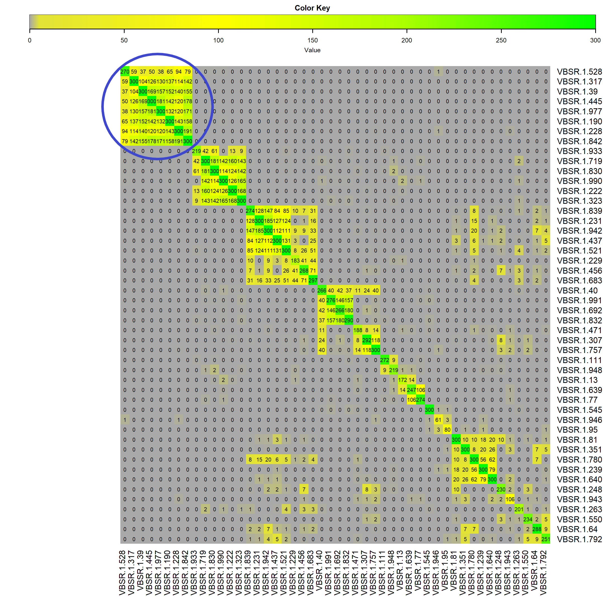
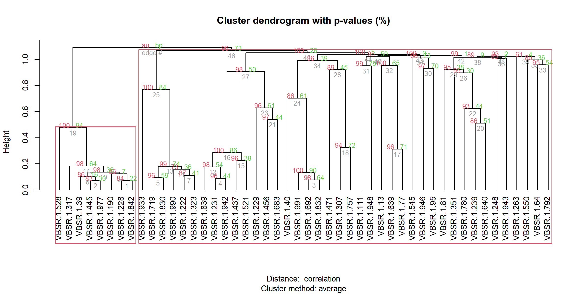
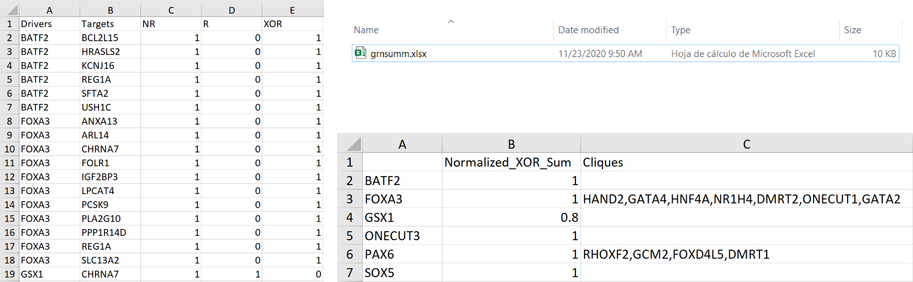

```{r LoadFunctions, echo=FALSE, message=FALSE, warning=FALSE, results='hide'}
library(knitr)
opts_chunk$set(error = FALSE)
library(TraRe)
```

```{r style, echo = FALSE, results = 'asis'}
##BiocStyle::markdown()
```

# Installation 
TraRe can be currently installed from Github using the devtools package (we are currently working to deliver it to Bioconductor):

```{r, eval=FALSE}

 if (!requireNamespace("BiocManager"))
 install.packages("BiocManager")
 BiocManager::install("MyPackage")

```
# Introduction

For fully understanding of how TraRe works, we will go through
every tool it contains: 

* *LINKER*, a module-based method manner of inferring gene regulatory networks.
* *Rewiring*, for selecting important modules from *LINKER* subject to a phenotype condition.
* Visualization,for graphically displaying generated GRN from previous process.
* Results, excel generation of useful information about drivers to targets relations from
previous GRN.

Along with every step description and explanation, we will be working with the Stand Up To Cancer (SU2C) clinical trial dataset containing 12971 genes ($\approx$ 2000 transcription factors or driver 
genes) and 121 samples from metasatic castration resistant prostate cancer patients. Patients were divided into two groups depending on the treatment: 
Abiraterone (ABI) and ABI-Enzalutemide (ARSI). For the phenotype dependent *Rewiring*, we will be 
focusing on only ARSI patients (35 samples). The pathway we will follow is:
  
* Run *LINKER* using the available gene expression matrix (GEM), 12971 genes and 121 samples, to generate all possible modules (GRN).

* Run *Rewiring* test selecting the sample's (ARSI) phenotype (35 samples) to extract *LINKER* modules which expression can be separated very well according to the selected phenotype. Selected modules will be scored based on a hypergeometric test.

* Run Visualization, generating GRN graphs of how the regulation process may change depending on the phenotype condition. (This step is included at the end of the previous one).

* Run Results, that generates an excel containing information about the driver-target relationships from the previously generated GRN graphs, and a brief summary that may be useful for biological validation of GRN. (This step is also included at the end of *Rewiring*).

The dataset we are working with is stored at the repository **jesusdfc/TraRe**. The data
used for the examples within TraRe's package is only a subset of this one, in order
to fulfill the space requirements of the package. We consider important to use a real dataset
for a proper understanding of TraRe's results.

# LINKER : Generating Gene Regulatory Networks

## Overview of the proposed method
The aim of the proposed method is to find relatively small networks
that link few regulatory (or driver) genes with a similarly regulated
set of genes, also known as the target genes. 
In order to build such networks, the method is divided into two
phases. During Phase I the method generates K modules of similarly
expressed genes and then associates each module to few regulators. 

Due to the non-convex nature of the problem, we perform
B runs of this step using a different set of samples (sub-sampling
without replacement) with a different random initialization in order
to explore more broadly the set of potentially valid modules. Thus, at 
the end of this step the method has generated
K  B modules of similarly regulated genes, each of them with their
associated regulators.  During Phase II  the
proposed method generates, for each module, a bipartite graph that links the individual target genes to their associated regulators. 

Note that if no combination of regulators represents
accurately the expression profile of a given target gene, that gene is
removed from the graph. This scenario arises when the target gene
in question was an outlier in the corresponding module.

## Running LINKER in TraRe

*LINKER* generates, from an initial RNA-Seq dataset where drivers (Transcription Factors) and targets genes are provided, GRN modules in three different forms: as raw results, from the phase I output modules; as modules from the phase II output modules and in the form of bipartite graphs, where drivers and targets relationships are defined. Here we include all the parameters and their description. For more information, please refer to the help section of `LINKER_run()`.

- **lognorm_est_counts** Matrix of log-normalized estimated counts of the gene expression data (Nr Genes x Nr samples).

- **target_filtered_idx** Index of the target genes on the lognorm_est_counts matrix.

- **regulator_filtered_idx** Index of the regulatory genes on the lognorm_est_counts matrix.

- **link_mode** Chosen method(s) to link module eigengenes to regulators. The available options are
"VBSR", "LASSOmin", "LASSO1se" and "LM". By default, all methods are chosen.

- **graph_mode** Chosen method(s) to generate the edges in the bipartite graph. The available options
are "VBSR", "LASSOmin", "LASSO1se" and "LM". By default, all methods are chosen.

- **module_rep** Method selected for use. Default set to MEAN.

- **NrModules** Number of modules that are a *priori* to be found (note that the final number of modules
discovered may differ from this value). By default, 100 modules.

- **corrClustNrIter** output from preparedata(). By default, 100.

- **Nr_bootstraps** Number of bootstrap of Phase I. By default, 10.

- **FDR** The False Discovery Rate correction used for the enrichment analysis. By default, 0.05.

- **NrCores** Nr of computer cores for the parallel parts of the method. Note that the parallelization
 is NOT initialized in any of the functions. By default, 2.

We now run *LINKER* method below. This is the first step from 
the pathway, running *LINKER* using the complete gene expression 
matrix to generate all possible GRN.

```{r, eval=FALSE, warning=FALSE, collapse=TRUE}

 # For this example, we are going to join drivers and targets from our github folder.

drivers <- readRDS(url('https://github.com/jesusdfc/TraRe/raw/master/tfs_linker_example.rds'))
targets <- readRDS(url('https://github.com/jesusdfc/TraRe/raw/master/targets_linker_example.rds'))

lognorm_est_counts <- rbind(drivers,targets)

# We create the index for drivers and targets in the log-normalized gene expression matrix.

R <- nrow(drivers)
P <- nrow(targets)

regulator_filtered_idx <- seq_len(L)
target_filtered_idx <- L+c(P)


# We recommend VBSR.

linkeroutput <- LINKER_run(lognorm_est_counts,target_filtered_idx,regulator_filtered_idx,
                           link_mode="VBSR",graph_mode="VBSR",NrModules=100,Nr_bootstraps=10)

```


*LINKER* also provides a way of generating a single GRN from specified list of driver and target genes. This eases the task of analyzing relationships between drivers and targets by constraining all the provided genes to a single GRN. Normally, this task is done when we have previously confirm all these genes belong to one GRN. The way we do this is by running the *Rewiring* method, that will be explained in the next section. Find below the necessary parameters and descriptions of `NET_run()`.

- **lognorm_est_counts** Matrix of log-normalized estimated counts of the gene expression
 data (Nr Genes x Nr samples)
- **target_filtered_idx** Index of the target genes on the lognorm_est_counts matrix.
- **regulator_filtered_idx** Index of the regulatory genes on the lognorm_est_counts matrix.
- **graph_mode** Chosen method(s) to generate the edges in the bipartite graph. The available options are "VBSR",
 "LASSOmin", "LASSO1se" and "LM". By default, all methods are chosen.
- **FDR** The False Discovery Rate correction used for the enrichment analysis. By default, 0.05.
- **NrCores** Nr of computer cores for the parallel parts of the method. Note that
the parallelization is NOT initialized in any of the functions. By default, 3.


In order to run the single GRN generation, there is a particular function that works very similar to the main *LINKER* one. Here is an example, which is also in the help section of `NET_run()`.

```{r,eval=FALSE,warning=FALSE,collapse=TRUE}

# Assume we have run the rewiring method and we have discovered a rewired module.
# After we have selected the drivers and targets from that modules, we can build
# a single GRN to study it separately.

# Imagine our rewired module consists of 500 driver genes and 4000 target genes.

drivers <- readRDS(url('https://github.com/jesusdfc/TraRe/raw/master/tfs_linker_example.rds'))
drivers <- drivers[seq_len(500),]

targets <- readRDS(url('https://github.com/jesusdfc/TraRe/raw/master/targets_linker_example.rds'))
targets <- targets[seq_len(4000),]

lognorm_est_counts <- as.matrix(rbind(drivers,targets)) #ensure is matrix-class

# We create the index for drivers and targets in the log-normalized gene expression matrix.

R <- nrow(drivers)
P <- nrow(targets)

regulator_filtered_idx <- seq_len(R)
target_filtered_idx <- R+seq_len(P)

# We recommend VBSR (rest of parameters are set by default)

graph <- NET_run(lognorm_est_counts,target_filtered_idx,
                  regulator_filtered_idx,graph_mode="VBSR")


```

Note that this step is included in the *Rewiring* method. 

# Rewiring GRN modules

## Overview of Rewiring method

* *Rewiring* step performs a permutation test over a certain condition to infer if that condition is producing any deregulation on our generated GRN. Bootstrapping plays an important role, as the non-convex nature of these biological events makes necessary to ensure that a certain behavior is repeated across bootstraps, and to confirm this event does not come from a particular realization. As bootstrapping has been performed in *LINKER*, this step will take advantage of them and will try to group highly scored modules, to infer modules similar behavior GRN across bootstraps. It will outputs a folder containing :

* A correlation matrix in the form of a heatmap (sorted by hierarchical clustering to ease interpretation), containing similar highly scored modules.
* A dendogram containing the relationships between modules, which have been used to sort the heatmap.
* A 3-graph plot, containing GRN within all samples and within sample's phenotype (R-NR).
* A report containing statistical information about the module's GRN, driver genes, target genes, pvalues, etc.


## How to run rewiring on TraRe

In order to run *Rewiring* test, *Trare* provides two functions: the `preparerewiring()` function and the `runrewiring()` function. First one requires


- **name** Desired name of the folder which is generated. The chosen
threshold will be `paste()` to the folder's name.
- **linker_saved_file** Output file from linker function path.
- **expr_matrix_file** Lognorm counts of the gene expression matrix path.
- **gene_info_file** path of a two-column file containing genes and 'regulator' boolean variable.
- **phenotype_file** path of a two-column file containing used samples and Responder or No Responder 'Class' (NR,R).
- **final_signif_thresh** Significance threshold for the rewiring method. The lower the threshold, the restrictive the method.

There are also other parameters that will remain by default. Please take
a look at the `preparerewiring()` function for more information. We now generate 
the `preparerewiring()` output.


Note that here we will include the previously generated *LINKER's* output. 
These files can be found at **jesusdfc/TraRe** repository.

```{r, eval=TRUE, warning=FALSE, collapse=TRUE}

expr_matrix <- 'https://github.com/jesusdfc/TraRe/raw/master/expression_rewiring_example.txt'

gene_info <- 'https://github.com/jesusdfc/TraRe/raw/master/geneinfo_rewiring_example.txt'

linker_output <-  'https://github.com/jesusdfc/TraRe/raw/master/linker_rewiring_example.rds'

phenotype_info <- 'https://github.com/jesusdfc/TraRe/raw/master/phenotype_rewiring_example.txt'

prepared <- preparerewiring(name="Vignette",linker_output,expr_matrix,gene_info,
                           phenotype_info,final_signif_thresh=0.05)


```


In order to run `runrewiring()`, we just call `runrewiring(prepared)`. It will create a folder on the specified output path with an html report containing the hierarchical clustering of the rewired modules, the rewired modules in the form of a heatmap and a report containing statistical information about the performed test.

{width=2400px,height=2400px}
As shown in the heatmap, there a is a clear **Super Module** (SM). For a SM to exist
there are some requirements that have to be fulfilled. First, These modules shall contain genes whose expression can be separated very well using the ARSI phenotype.
Second, they have shown a similar behavior across bootstraps, with an score
given by its hypergeometrical test. Therefore, there exist a SM formed by `c(298,945,698,619,795,156,63,214,563)` modules.

{width=2400px,height=1200px}

In the figure above the Hierarchical Clustering applied shows how the SM
we are talking about has been selected. The current implementation of *Rewiring*
method pulls away the first SM it finds and generate all the graph objects 
and figures we are showing in the next section.

# Visualization of GRN 

## Overview

This tool provides a graphical way of detecting condition-dependent GRN deregulation on the selected rewired modules. Once we have selected a cluster of modules which behave similar across bootstraps, we can constraint them to form a single GRN using `NET_Run()` and plot these GRN, filtering by samples we want to evaluate according to the phenotype condition. 

## Plot GRN in TraRe

We provide two ways of building the layout for the plot, depending on the choice of a t.test to be evaluated over the generated GRN, to sort target genes prior to plot the established relationship between these and drivers. On the one hand, `return_layout()` generates a regular layout in which there is no t.test, and target genes are sorted randomly in a line. On the other hand, `return_layout_phenotype()` performs a target gene level t.test which has as null hypothesis if samples separated by the selected condition are not deferentially expressed. From this analysis, the z-score is used to sort target genes and plot them describing a curve when using `plot_igraph()` function. 

```{r,eval=TRUE,warning=FALSE,collapse=TRUE}

# Assume we have run the rewiring method and the `NET_run()` method to generate the
# igraph object. We are going to generate and plot both layouts for the example.
# We are going to generate all the files we need except for the igraph object, which
# is included as an example file in this package.


# We load the igraph object that we generated from the `NET_run()` example.
# Note: the igraph object is inside the list `NET_run()` generates.

graph <- readRDS(url('https://github.com/jesusdfc/TraRe/raw/master/graph_netrun_example.rds'))
graph <- graph$graphs$VBSR

# We first generate the normal layout for the plot.
# We need the drivers and target names. 

drivers <- readRDS(url('https://github.com/jesusdfc/TraRe/raw/master/tfs_linker_example.rds'))
targets <- readRDS(url('https://github.com/jesusdfc/TraRe/raw/master/targets_linker_example.rds'))

# Note that the generated graph may not have the same drivers and targets we used
# for generating it, so we wil extract those genes and check in the gene_info file
# if they are drivers or targets.

geneinfo <- url('https://github.com/jesusdfc/TraRe/raw/master/geneinfo_rewiring_example.txt')
geneinfo <- read.delim(file=geneinfo)[,c("uniq_isos","regulator")]

R<-intersect(geneinfo[geneinfo$regulator==1,1],names(igraph::V(graph)))
P<-intersect(geneinfo[geneinfo$regulator==0,1],names(igraph::V(graph)))

drivers_n <- rownames(drivers[R,])
targets_n <- rownames(targets[P,])

# As for this example we are working at gene level (we dont have transcripts inside genes),
# we wont need namehash parameter (see param `namehash`)

normal_layout <- return_layout(drivers_n,targets_n)

# We need to separate our expression matrix by a binary phenotype. 
# This is what the clinical file is used for.

gnames <- c(drivers_n,targets_n)
expmat <-rbind(drivers,targets)

clinic <- url('https://github.com/jesusdfc/TraRe/raw/master/phenotype_rewiring_example.txt')
clinic <- utils::read.delim(clinic)

expmat_R <- expmat[,clinic$Sample.ID[clinic$Class=='R']]
expmat_NR <- expmat[,clinic$Sample.ID[clinic$Class=='NR']]

# We now generate the phenotype layout and the `varfile` we need for this layout.
# (I leave here a way to generate)

varfile <- t(as.matrix(sapply(gnames,
           function(x) c(stats::t.test(expmat_R[x,],expmat_NR[x,])$statistic,
           if(x%in%drivers_n) 1 else 0))))

colnames(varfile)<-c("t-stat","is-regulator")

phenotype_layout <- return_layout_phenotype(drivers_n,targets_n,varfile)

plot_igraph(graph,mytitle="Normal Layout",titlecol="black",mylayout=normal_layout)
plot_igraph(graph,mytitle="Phenotype Layout",titlecol="black",mylayout=phenotype_layout)
    

```

For further information, please refer to the help file of `plot_functions()`.
Note that this method is included in the *Rewiring* test; the generation
of the graph objects depending on the phenotype is automated. Here we include
the figures generated from the *Rewiring* step.

{width=1500px,height=750px}


# Cliques method and results

## Overview 

* *Cliques:* From the chosen individual GRN, an excel file is generated containing drivers-targets relationships and cliques. The way *LINKER* works may lead TFs to be dropped out during the fitting process in the presence of highly correlated TFs whose roles in the GRN are very similar. Due to this, we propose a method based on cliques (Fully Connected Networks) to recover these dropped driver genes.

From all previous analyses, we provide an informative way of looking at the generated GRN, the relationships they have within the network, easing a possible biological validation afterwards in silico analysis.

# Generate file in TraRe

The `excel_generation()` function takes as input a working path and a boolean variable,
specifying if desirable to include cliques in the summary of the generated excel. If so,
arguments from `generate_cliques()` are required, but only the drivers expression matrix is 
mandatory, the rest of them have default values.

- **wpath** working path, where graph object (should be called 'refinedsumm.rds') should be
 and where the excel file ('grnsumm.xlx') will be saved. (Default: working directory)
- **cliquesbool** indicating if cliques method should be added to the summary table. (Default: TRUE)
- **...** every argument you should pass to generatecliques() in case cliquesbool is TRUE.

```{r,eval=TRUE,warning=FALSE,collapse=TRUE}

## For this example, we are going to use a generated 'refinedsumm.rds' from the su2c dataset
## (see vignette of TraRe for more information), which is at the external data folder
## of this package.

gpath <- url('https://github.com/jesusdfc/TraRe/raw/master/Su2c_0.05/refinedsumm.rds')

## We are going to use the drivers dataset from the external data folder as well.
## For more information about generatecliques() please check the corresponding help page.

dataset<- readRDS(url('https://github.com/jesusdfc/TraRe/raw/master/tfs_linker_example.rds'))
excel_generation(gpath=gpath,dataset=dataset)

```

We here include a brief example in order to finish the analysis for this SU2C prostate cancer 
GEM. After generating the plots where a possible deregulation from one phenotype to other
may be appreciated, we can extract more specific driver to target information.

{width=650 height=200px}
